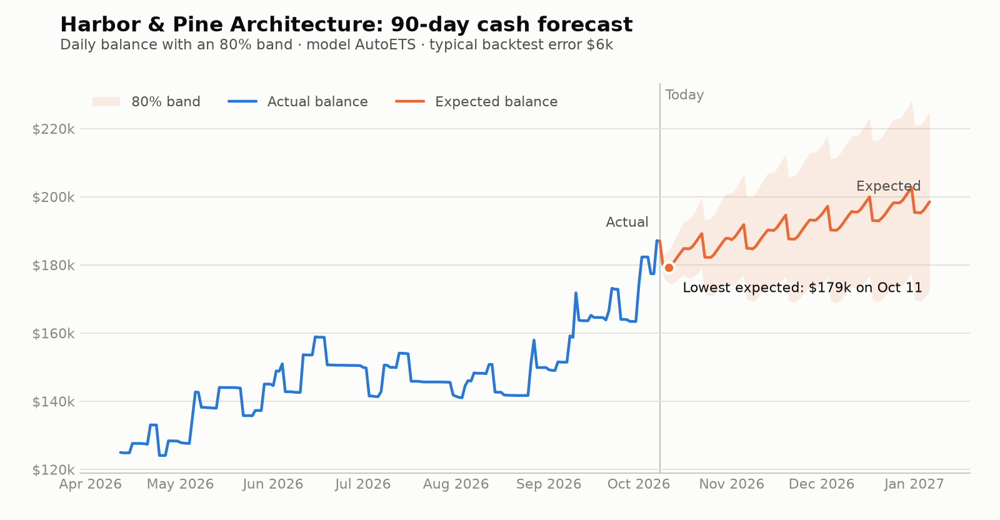

# Cashflow Insights

[](https://github.com/zasmall/cashflow-insights/actions/workflows/ci.yml)

Forecasts a small business's cash 30, 60, and 90 days out, with honest confidence bands, and flags what looks wrong right now: duplicate charges, spending spikes, missed bills, price changes. Categorized transactions stream in through a webhook relay; a FastAPI app serves reports, and an MCP server lets Claude answer questions about the books.

Python 3.13 · FastAPI · Pydantic v2 · SQLAlchemy 2 + Postgres · Polars · statsforecast · MCP · strict mypy · 225 tests

## The problem

A bookkeeper can see every transaction and still not know the two things an owner asks: *where will my cash be next quarter?* and *is anything off?* The answers live in patterns, such as which bills recur, when income lands, and what's unusual for this business, that no one has time to read off a ledger every week.

## How it fits together

```
Transaction Categorizer ──transaction.categorized──▶ Webhook Relay ──signed, retried──▶ Cashflow Insights
 (imports, rules, AI, review)                        (dedupe, backoff, rate limit)       (ingest → detect → forecast → scan)
                                                                                                │
                                                                     REST API ◀── core services ──▶ MCP server ◀── Claude
```

Three portfolio repos, each runnable alone, connected end to end: [Transaction Categorizer](https://github.com/zasmall/Transaction-categorizer) (Laravel) publishes every approved categorization; [Webhook Relay](https://github.com/zasmall/webhook-relay) (Laravel) delivers it at least once, signed; this service verifies it, stores it idempotently, and recomputes that business's recurring bills, forecast, and anomalies in the background. `scripts/e2e-demo.sh` runs the whole chain locally ([docs/DEMO.md](docs/DEMO.md)).

## What it produces

<picture>
  <source media="(prefers-color-scheme: dark)" srcset="docs/images/forecast-dark.png">
  
</picture>

- **A balance forecast**: known recurring flows (payroll, rent, subscriptions, retainers) are projected exactly, and everything else is modelled, with an 80% band and its own backtested accuracy.
- **Anomalies with plain-English explanations and evidence**, for example *"Google Workspace's monthly charge of $72.00 was expected on Sep 3, 2026 and hasn't arrived (2 expected charges missed; last seen Aug 3, 2026)."*
- **A weekly summary**: cash in and out against recent weeks, top discretionary spending, bills due in the next 7 days, the forecast's low point, and the most important open anomalies.
- **Answers through Claude.** A real session ([full transcript](docs/EXAMPLE_SESSION.md)):

> **You:** Will Harbor & Pine run low on cash in the next 90 days? How much should I trust that forecast?
>
> *Claude calls `get_forecast(entity_id="demo-42", horizon_days=90)`*
>
> **Claude:** **No, Harbor & Pine doesn't look likely to run low.** The balance is $186.9k today (Oct 8). The expected path dips no lower than about **$179.3k** (Oct 11) [...] **How much to trust it: fairly well for the overall direction, less for exact amounts.** [...] **Typical miss: about $6k at 90 days**, roughly 3% of the balance. [...] **The range is cautious:** it's meant to contain the actual balance 80% of the time, but in past data it did so 96% of the time.

## How the forecast works, and how good it is

1. **Detect recurring series** per vendor and direction: a stable median amount, regular calendar-aware timing, enough evidence, and not ended. Recall is exact against the demo generator's ground truth across thousands of random businesses.
2. **Project them** over the horizon on their anchor day (bills on the 31st land on the 30th in short months).
3. **Model the residual** (everything else, summed daily) with statsforecast, then build the balance band from the model's one-step spread, growing with √days.
4. **Backtest end to end** at three past cutoffs, re-running detection on only the data available then, and **choose the model with the lowest balance error**.

Measured on 20 businesses, forecasting from 90 days before the end of their data and comparing with what actually happened:

| Horizon | Error vs a "balance stays flat" guess | Actual balance inside the 80% band |
|---|---|---|
| 30 days | 0.99×: no real gain, lumpy client revenue dominates | 80% |
| 60 days | 0.98× | 90% |
| 90 days | **0.58×** | 95% |

The forecast earns its keep further out, where bills, income, and trend accumulate and a flat guess can't see them. The tests pin these results, so a regression fails CI.

## Key decisions

- **Choose models on balance error, not MASE.** The first version picked models on daily-flow error (MASE), as planned. That chose SeasonalNaive for some businesses, which copies last week; its errors compound into a **39%** balance error at 90 days, against 6% for the alternatives. The metric now matches what a reader sees.
- **Version by the source's clock.** Out-of-order delivery is normal with retries, so a transaction is only overwritten by a version whose `categorized_at` (set by the categorizer) is at least as new. The relay's own timestamp is when *it* received the event, which a delayed retry can invert.
- **Answer 2xx to problems a retry can't fix.** The relay retries anything but 2xx and counts failures toward a circuit breaker, so a malformed or unknown-business event is stored with its reason and acknowledged, instead of pausing every delivery. Only signature failures (401) and real errors (5xx) are refused.
- **Record and apply each event in one transaction.** If processing fails, the dedupe record rolls back with it, so the relay's retry is processed instead of being mistaken for a duplicate.
- **Opaque upstream IDs.** Nothing parses the categorizer's IDs, so its ID scheme can change freely.
- **Read-only MCP, enforced three ways:** tool annotations, a test that pins the exact tool set, and Postgres `READ ONLY` transactions, so even a buggy tool can't write.
- **Demo data with exact ground truth.** The seeded generator plants one of each anomaly and reports what it planted, and it prevents accidental anomalies by construction. Detection tests can then demand exactly the planted findings and nothing else, and property tests and sweeps run against it found real bugs: an annual bill on Feb 29 predicted on the 28th, and two similar flights a year apart detected as an "annual series".
- **Money is `Decimal` end to end** and `NUMERIC(14,2)` in Postgres. Floats exist only inside the forecasting maths.

More in [docs/ARCHITECTURE.md](docs/ARCHITECTURE.md).

## Running it

Requires [uv](https://docs.astral.sh/uv/) and Docker.

```bash
cp .env.example .env                  # then set WEBHOOK__SECRET (the API won't start without it)
uv sync
docker compose up -d
uv run alembic upgrade head
uv run python -m cashflow.demo.seed   # two synthetic businesses, 24 months each, with forecasts
uv run fastapi dev src/cashflow/api/main.py --port 8003   # 8000 is the relay's
```

Then open `http://localhost:8003/docs` to explore the API, or:

```bash
curl "localhost:8003/entities/demo-42/forecast?horizon=90"
curl "localhost:8003/entities/demo-42/anomalies"
curl "localhost:8003/entities/demo-42/summary"
```

**Real businesses** arrive from Transaction Categorizer through Webhook Relay. Provision each one with its opening balance (the categorizer doesn't know balances); events that arrived before it are applied then:

```bash
uv run python -m cashflow.entities add --id 1 --name "Northwind Coffee Co." --opening-balance 25000.00 --as-of 2025-12-31
```

New transactions refresh their business in a background task. Those are in-process, so a restart can drop one, but the business stays flagged until a refresh succeeds; this catches up (run it from cron):

```bash
uv run python -m cashflow.refresh --dirty    # or --entity ID / --all; --as-of DATE for older data
```

**End-to-end demo** across all three repos: `scripts/e2e-demo.sh setup`, then `run` ([docs/DEMO.md](docs/DEMO.md)). The forecast chart regenerates with `uv run --group docs python scripts/forecast_chart.py`.

### Ask Claude (MCP)

```bash
claude mcp add cashflow-insights -- uv run --directory /absolute/path/to/cashflow-insights python -m cashflow.mcp_server
```

For **Claude Desktop**, add this to `claude_desktop_config.json` (Settings → Developer → Edit Config) and restart. Use `uv`'s absolute path (`which uv`) if Desktop can't find it.

```json
{
  "mcpServers": {
    "cashflow-insights": {
      "command": "uv",
      "args": ["run", "--directory", "/absolute/path/to/cashflow-insights", "python", "-m", "cashflow.mcp_server"]
    }
  }
}
```

Seven read-only tools: `list_entities`, `get_weekly_summary`, `get_forecast`, `list_anomalies`, `explain_anomaly`, `spend_by_category`, `list_recurring`.

### Tests

```bash
uv run ruff check . && uv run ruff format --check .
uv run mypy                # strict, including tests and scripts
uv run pytest
```

Unit and property tests (Hypothesis) cover signatures, recurring detection, anomaly rules, bands, and summaries. Accuracy tests run the forecast against held-out data, and ground-truth tests check detection against the generator. Database tests run against a separate `cashflow_test` database, recreated and migrated each run. API and MCP tests go through FastAPI's test client and the real MCP protocol, including the stdio entry point.

## What I'd do next

- **API keys** for the report endpoints; today only the webhook is authenticated.
- **A durable job queue** (such as Postgres `SKIP LOCKED` or Redis) in place of in-process background tasks, which is the scaling limit. The dirty flag already makes recovery safe.
- **Close the approved-only gap.** Only approved categorizations are published, so transactions awaiting review are missing from the balance. A `transaction.imported` event would fix it.
- **Project known price changes at the new amount.** A series keeps its old median price until the new one is the majority. That is good for flagging the change, but it underestimates the bill meanwhile. Claude spotted this in the [example session](docs/EXAMPLE_SESSION.md).
- **Tell apart two subscriptions from one vendor** (for example $89.99 and $22.99 monthly), which today split the amounts so neither is detected. This needs an amount-clustering step that doesn't split ordinary price changes.
- **Keep forecast history** to measure drift, rather than only the latest run.
- **An admin UI** for provisioning businesses and reviewing anomalies.

## License

[AGPL-3.0-or-later](LICENSE).
